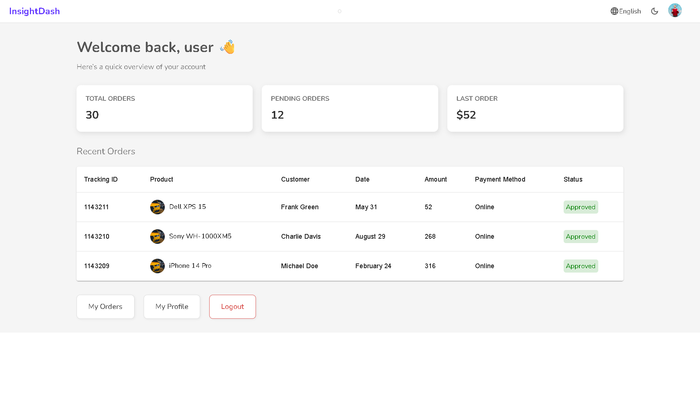
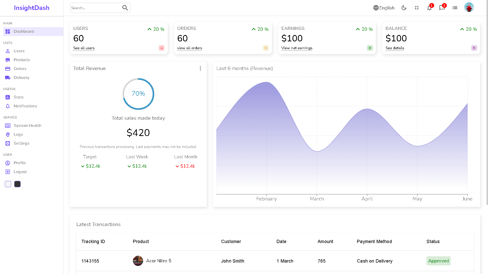
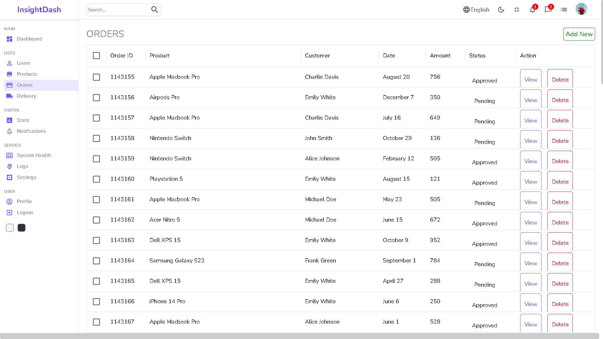

# 📊 InsightDash — Role-Based Admin & User Dashboard

InsightDash is a **frontend-focused dashboard application** built with React that demonstrates **role-based authentication, protected routes, and modern dashboard UI patterns** commonly used in real-world SaaS products.

This project is intentionally designed for **frontend internships**, focusing on UI architecture, state management, and UX decisions rather than backend complexity.

---
## TL;DR
- Role-based admin & user dashboard
- Frontend-only auth using Context API
- Protected routes with React Router
- Clean SaaS-style UI
- Deployed on Netlify

## 🚀 Live Demo

🔗 **Live URL:** https://insightdashh.netlify.app/

---

## 🔐 Demo Credentials

> Authentication and data are mocked for frontend demonstration purposes.

### Admin
- **Username:** `admin`
- **Password:** `admin`

### User
- **Username:** `user`
- **Password:** `user`

---

## 🧠 Key Features

### ✅ Role-Based Authentication
- Mock authentication using **React Context API**
- Two roles: **Admin** and **User**
- Persistent login using **localStorage**

### ✅ Admin Dashboard
- Overview widgets (Users, Orders, Earnings, Balance)
- Analytics charts
- Orders management with actions
- Admin-only sidebar navigation

### ✅ User Dashboard
- Personalized home page
- Account summary
- Recent orders table
- Clean UI without admin controls

### ✅ Protected Routes
- Users cannot access admin-only pages
- Route-level access control based on role
- Conditional rendering for UI elements

### ✅ Modern UI & UX
- Clean SaaS-style dashboard layout
- Reusable cards and tables
- Responsive design
- Consistent spacing, typography, and colors

---

## 🛠️ Tech Stack

- **React**
- **React Router**
- **Context API**
- **SCSS / CSS**
- **LocalStorage**
- **Netlify (Deployment)**

> ❌ No backend  
> ❌ No real database  
> ✔ Frontend-focused architecture and UI logic

---
## 📂 Project Structure (High Level)
```src/
├── components/
├── context/
│ └── AuthContext.js
├── pages/
│ ├── login/
│ ├── dashboard/
│ ├── orders/
│ ├── profile/
│ └── userHome/
├── routes/
├── styles/
└── App.jsx
```


---

## 🧭 Routing Overview

- `/login` → Login page
- `/` → User home (User only)
- `/dashboard` → Admin dashboard (Admin only)
- `/orders` → Orders page (Admin only)
- `/profile` → Profile page (Role-based view)

Client-side routing is handled using **React Router**, with Netlify redirects configured for refresh-safe navigation.

---

## 📸 Screenshots

> Key screens showcasing **role-based access**, **dashboard UI**, and **user/admin flows**.

### 🔐 Login Page
Mock authentication entry point for Admin and User roles.


---

### 👤 User Dashboard
Personalized dashboard for users with order summary and recent activity.



---

### 👤 User Profile & Account Summary
User profile page displaying personal details and account summary.


---

### 🧑‍💼 Admin Dashboard
Admin-only dashboard with analytics, widgets, and charts.



---

### 📦 Orders Management (Admin)
Orders table with actions and status indicators.



---

## 📌 Notes for Reviewers

- All data shown is **mocked**
- Authentication is **frontend-only**
- Focus areas:
  - Role-based UI rendering
  - State management
  - Component structure
  - Dashboard UX patterns

---

## 📈 Future Improvements

- Replace mock auth with Firebase / JWT
- Connect to real backend APIs
- Add pagination & advanced filters
- Improve accessibility
- Add dark mode toggle

---

## 👤 Author

**Aditya Verma**  
Frontend Developer  

- GitHub: https://github.com/adit-ya15
- Portfolio: *(add if available)*

---

## ⭐ If you like this project

Feel free to ⭐ the repository — it helps a lot!

